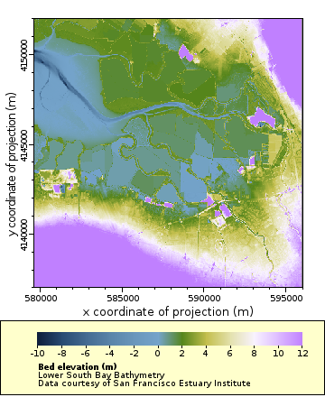

# lsb_master_dem
Scripts for generating Lower South Bay, San Francisco Bay, composite DEM

The scripts merge topography and bathymetry data from a range of sources, notably:
  1. <A href="https://topotools.cr.usgs.gov/topobathy_viewer/dwndata.htm">USGS 2m seamless topobathy of the Bay</A>
  2. Manually interpolated slough cross-sections (Ed Gross, Rusty Holleman)
  3. A small number of manually inserted levees breaches
  4. <A href="https://pubs.usgs.gov/of/2011/1315/">USGS Alviso Slough data</A>
  5. NOAA Multibeam surveys of subtidal areas.  Only one subdataset (subtidal, Lower South Bay) was used from these.
     - <a href="https://coast.noaa.gov/data/Documents/Metadata/Benthic/harvest/ca_sfb14_mbs_bath-A-meta.xml">2014 Multibeam</a> 
     - <a href="https://coast.noaa.gov/data/Documents/Metadata/Benthic/harvest/ca_sfb14_sss_bath-A-meta.xml">2014 Sidescan</a>
     - <a href="https://coast.noaa.gov/data/Documents/Metadata/Benthic/harvest/ca_sfb15_sss_bath-B-meta.xml">2015 Sidescan</a>

The resulting 2m, stitched dataset is available via 
<a href="http://sfbaynutrients.sfei.org/erddap/griddap/bathy_sfei_lsb_v001.graph">SFEI ERDDAP</a>
 

